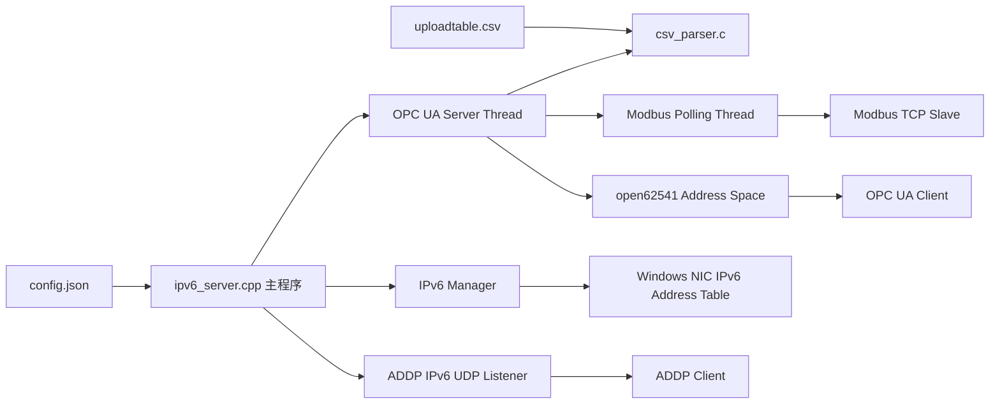
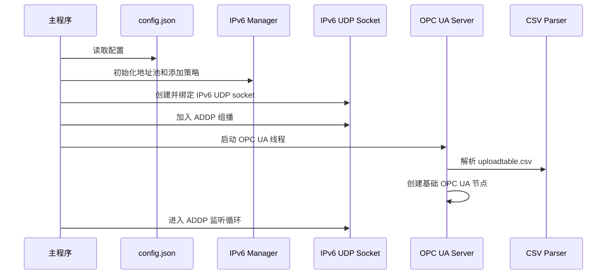
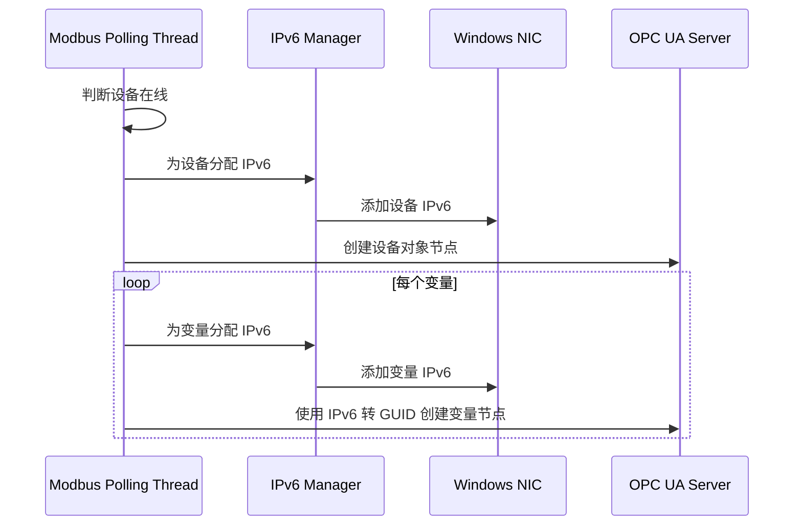
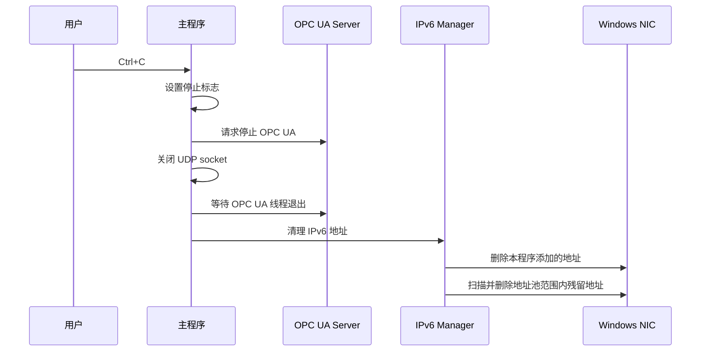

# 概要设计文档

## 1. 系统目标

本系统是一个 Windows AUTBUS 控制器模拟/网关程序，面向以下场景：

- 通过 IPv6 组播接收 ADDP 扫描请求，并返回控制器信息。
- 启动 OPC UA Server，向外暴露控制器、总线、设备和变量节点。
- 从 CSV 表加载 AUTBUS 子设备和属性变量。
- 通过 Modbus TCP 读取现场数据，并更新 OPC UA 变量值。
- 为设备和变量分配 IPv6 地址，并配置到 Windows 网卡，使外部客户端可通过这些 IPv6 地址访问 OPC UA Server。

## 2. 总体架构



## 3. 主要模块

### 主程序模块

文件：`src/ipv6_server.cpp`

职责：

- 读取 `config.json`。
- 初始化日志、Winsock、IPv6 地址管理器。
- 创建 IPv6 UDP socket，加入 ADDP 组播。
- 启动 OPC UA Server 线程。
- 进入 ADDP 主循环。
- 程序退出时关闭 socket、停止 OPC UA、清理 IPv6 地址。

关键入口：

- `main(...)`
- `read_ipv6_config(...)`
- `main_loop(...)`

### ADDP/IPv6 监听模块

文件：`src/main_loop.cpp`、`src/addp_protocol.cpp`

职责：

- 监听 IPv6 UDP 组播请求。
- 解析 ADDP scan request。
- 构造 ADDP device response。
- 返回控制器名称、型号、IPv6 地址、MAC、OPC UA 端口和路径。

### OPC UA Server 模块

文件：`src/opcua_server.c`

职责：

- 创建 open62541 OPC UA Server。
- 创建根节点、Bus 节点、设备节点、变量节点。
- 将 IPv6 字符串转换为 GUID NodeId。
- 为可写变量注册 read/write callback。
- 根据 Modbus 轮询数据刷新变量值。
- 动态管理在线设备节点。

关键函数：

- `opcua_server_main(...)`
- `createVariableNode(...)`
- `addDeviceNodes(...)`
- `modbusPollingThread(...)`
- `build_modbus_read_plan(...)`

### CSV 解析模块

文件：`src/csv_parser.c`、`src/csv_parser.h`

职责：

- 解析 `uploadtable.csv`。
- 生成 `CSVRecord` 列表。
- 提供设备名、节点名、Modbus 地址、寄存器类型、PLC 数据类型等信息。

CSV 记录会驱动 OPC UA 变量节点创建和 Modbus 轮询计划生成。

### Modbus TCP 模块

文件：`src/modbus_client.c`、`src/modbus_client.h`

职责：

- 初始化 libmodbus TCP client。
- 连接 Modbus TCP 从站。
- 读取线圈、离散输入、保持寄存器、输入寄存器。
- 写单线圈、写单寄存器。
- 断线重连。

### IPv6 地址管理模块

文件：`src/ipv6_manager.c`、`src/ipv6_manager.h`

职责：

- 初始化 IPv6 地址池。
- 按顺序生成唯一 IPv6 地址。
- 将 IPv6 地址添加到 Windows 网卡。
- 删除网卡上的 IPv6 地址。
- 维护设备/变量与 IPv6 的映射。
- 管理批量添加限速。
- 程序退出时清理地址池范围内的 IPv6 地址。

Windows 当前实现使用：

- `CreateUnicastIpAddressEntry`
- `DeleteUnicastIpAddressEntry`
- `GetAdaptersAddresses`

添加地址时设置：

- `PrefixOrigin = IpPrefixOriginManual`
- `SuffixOrigin = IpSuffixOriginManual`
- `SkipAsSource = TRUE/FALSE`，默认 TRUE
- `ValidLifetime = 0xffffffff`
- `PreferredLifetime = 0xffffffff`

## 4. 关键运行流程

### 启动流程



### 设备上线和变量节点创建流程



### IPv6 批量添加限速

大量设备和变量上线时，程序可能需要添加上千个 IPv6 地址。为降低 Windows 网络栈、NLA、SSDP、IPsec 等服务的瞬时压力，当前实现：

- 添加 IPv6 时设置 `SkipAsSource=true`。
- 成功添加新地址后累计计数。
- 达到 `batch_add_limit` 后设置延迟标记。
- 不在当前设备变量处理中睡眠。
- 等处理下一个在线设备前再延迟 `batch_add_delay_ms`。

默认值：

```json
"skip_as_source": true,
"batch_add_limit": 300,
"batch_add_delay_ms": 4000
```

### 退出清理流程

Ctrl+C 正常退出时：



清理来源包括：

- 本程序实际添加到网卡的地址列表。
- 已分配地址缓存。
- 当前网卡上仍存在且落在地址池范围内的地址。

## 5. 配置设计

### IPv6 地址池

地址池由 `start_address` 和 `end_address` 定义。程序从起始地址开始递增分配。

地址池范围内的地址被视为本程序管理地址，退出清理时可以删除。

### SkipAsSource

`skip_as_source=true` 用于防止变量 IPv6 被 Windows 随机选为出站源地址，同时减少这些地址对系统网络行为的影响。

该设置不能保证 Windows 所有服务完全忽略地址变化，但能减少源地址选择和部分网络服务处理压力。

### 批量延迟

`batch_add_limit` 和 `batch_add_delay_ms` 用于控制批量添加地址时的节奏。

推荐现场压测组合：

- `100 + 4000 ms`
- `200 + 4000 ms`
- `300 + 4000 ms`

## 6. 数据设计

### CSVRecord

每条 CSV 记录包含：

- Modbus 地址。
- 原始变量名。
- 寄存器类型。
- PLC 数据类型。
- 描述。
- 设备名。
- OPC UA 节点名。

### OPC UA NodeId

变量和设备节点使用 IPv6 转 GUID 的方式生成 NodeId：

```text
IPv6 字符串 -> 16 字节 GUID -> UA_NODEID_GUID
```

这保证每个变量节点有稳定唯一的 NodeId。

## 7. 异常和恢复设计

### Modbus 断线

Modbus 轮询失败后：

- 标记连接断开。
- 关闭当前连接。
- 等待 `reconnect_interval` 后重连。

### IPv6 添加失败

添加失败时：

- 当前地址从分配缓存中移除。
- 变量 IPv6 置空。
- OPC UA 节点仍可使用默认地址创建，避免整个设备创建流程中断。

### 程序异常退出

任务管理器强杀或系统崩溃时，进程内清理无法执行。下次程序正常退出时，会扫描地址池范围内残留地址并删除。

## 8. 安全边界

IPv6 清理只应删除配置地址池范围内的地址，不应删除网卡上的其它业务地址。

程序运行需要管理员权限，因为 Windows 添加和删除网卡 IPv6 地址需要提升权限。

## 9. 后续演进方向

当前方案直接将大量变量 IPv6 配置到 Windows 网卡。长期可考虑代理方案：

- 使用 Wintun 或其它三层虚拟网卡。
- 将变量 IPv6 地址池路由到代理程序。
- 代理程序根据目标 IPv6 转发到同一个 OPC UA Server。

这样可以避免在物理网卡上直接挂载上千个单播 IPv6 地址，进一步降低 Windows 网络服务的 CPU 压力。

